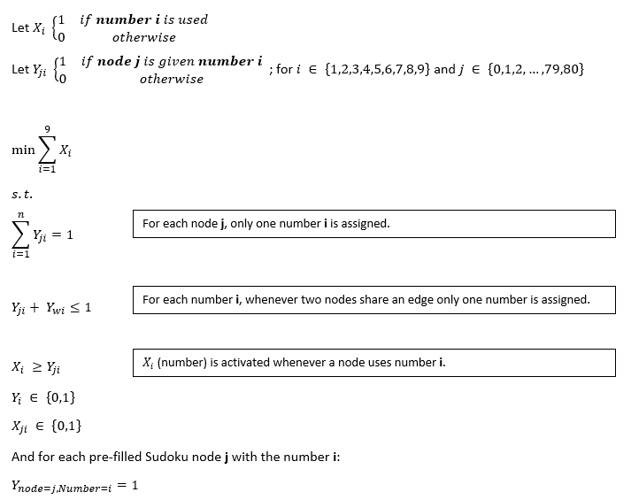

# sudoku problem

View notebook <a href="https://github.com/irecasens/sudoku/blob/master/Sudoku%20Puzzle%20Notebook.ipynb"> here </a>.

The chromatic number of a graph has many applications in Management Science. Prominent examples are timetabling, scheduling, or solving a Sudoku puzzle.

A Sudoku puzzle is a problem where there is an incomplete 9x9 table of numbers which must be filled according to the following rules:
- The table can be divided into 9 individual 3x3 boxes. In each of these boxes, every number (i.e. a color) between 1 to 9 must appear at least (and at most) once.
- Within any column of the 9x9 grid, each number between 1 to 9 must be appear at least (and at most) once.
- Within any row of the 9x9 grid, each numbers between 1 to 9 must be appear at least (and at most) once.

## ILP Formulation:

